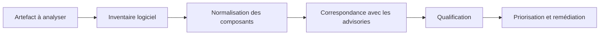

Trois scanners analysent le même dépôt ou la même image. Le premier annonce douze vulnérabilités critiques, le deuxième en voit sept, le troisième estime que deux seulement doivent être corrigées immédiatement.

La réaction habituelle consiste à demander lequel se trompe. C’est souvent la mauvaise question.

Un résultat de scan n’est pas une mesure directe et universelle du risque. C’est la conclusion d’une chaîne de décisions : quels composants ont été détectés, quelle version leur a été attribuée, quelle source d’advisories a été consultée, comment la sévérité a été choisie et quel contexte a été ajouté. Trivy, OSV-Scanner et Snyk ne font pas exactement les mêmes choix, parce qu’ils ne cherchent pas à répondre à la même question.

## Avant le score, il y a l’inventaire

Tous les scanners suivent un pipeline comparable :



La plupart des divergences naissent avant la note finale. Si deux outils n’extraient pas le même package, ne résolvent pas la même version ou ne retiennent pas le même advisory, comparer leur colonne `severity` ne permet pas de les départager.

Il faut donc séparer quatre notions :

- **la détection** : ce composant est-il présent ?
- **la correspondance** : cette version appartient-elle à une plage affectée ?
- **la sévérité** : quel est l’impact technique de la vulnérabilité ?
- **la priorité** : compte tenu de notre contexte, quand devons-nous agir ?

Cette séparation explique l’essentiel des différences entre les trois outils.

## Trivy observe d’abord l’artefact

Trivy est un capteur généraliste. Il peut analyser des images de conteneurs, des systèmes de fichiers, des dépôts, des SBOM, des configurations IaC ou encore des clusters Kubernetes. Pour les vulnérabilités, il commence par identifier ce qui est effectivement présent dans la cible.

Son choix le plus structurant concerne les packages du système d’exploitation. Lorsqu’un package provient de `dpkg`, `rpm` ou `apk`, Trivy utilise les advisories du fournisseur de la distribution. Ce comportement évite un faux positif classique : une distribution peut conserver un numéro de version ancien tout en rétroportant le correctif de sécurité.

Un package Red Hat peut donc être classé `LOW` alors que la même CVE est `HIGH` dans le NVD. Ce n’est pas nécessairement une incohérence. La distribution connaît ses options de compilation, sa configuration par défaut et les correctifs qu’elle a intégrés. Trivy conserve d’ailleurs cette provenance dans des champs comme `SeveritySource` et `VendorSeverity`.

Trivy répond ainsi surtout à cette question :

> Que contient réellement cet artefact, et qu’en dit le fournisseur responsable de ce composant ?

Ce choix améliore la précision, mais il a un coût. Si l’advisory du fournisseur tarde ou manque, une vulnérabilité peut ne pas apparaître. Le mode `--detection-priority comprehensive` accepte davantage de bruit pour élargir la couverture. Ce réglage modifie le compromis entre faux positifs et faux négatifs ; il ne transforme pas Trivy en moteur de risque métier.

## OSV-Scanner raisonne dans le langage de l’écosystème

OSV-Scanner se concentre sur la relation entre un package, une version et une plage affectée décrite dans la base OSV. Cette base représente les versions selon les conventions natives des écosystèmes, plutôt que de tout ramener à une identification générique.

Dans un dépôt source, les manifests et surtout les lockfiles décrivent les versions résolues. Dans une image, les composants effectivement installés sont plus fiables qu’un lockfile oublié dans le système de fichiers. OSV-Scanner extrait et normalise ces informations, puis vérifie si la version ou le commit appartient à une plage déclarée comme vulnérable.

Sa question centrale est plus étroite que celle de Trivy :

> Ce package précis, dans cet écosystème et à cette version, appartient-il à une plage affectée connue ?

Cette spécialisation est précieuse pour comprendre une divergence de correspondance. OSV permet aussi de relier des identifiants équivalents (OSV, CVE ou GHSA) qui décrivent la même vulnérabilité.

En revanche, la qualité de la note dépend des données publiées dans l’advisory. Une entrée peut contenir un vecteur CVSS, plusieurs formes de sévérité ou aucune note exploitable. OSV-Scanner établit une correspondance reproductible entre un package, une version et les plages affectées publiées dans OSV. Il ne démontre pas à lui seul que le code vulnérable est exploitable dans l’application.

## Snyk organise aussi la remédiation

Snyk Open Source part généralement des manifests et lockfiles pour construire un graphe de dépendances. Ce graphe distingue les dépendances directes et transitives et montre le chemin par lequel une librairie vulnérable entre dans le projet.

Le finding est ensuite enrichi avec des signaux comme la sévérité, la maturité d’un exploit, la reachability lorsqu’elle est disponible, la présence d’un correctif et le contexte du projet. Snyk ne se limite donc pas à dire qu’une version est affectée. La plateforme cherche aussi à ordonner le travail de correction.

Sa question devient :

> Parmi les problèmes de ce portefeuille, lequel faut-il traiter en premier ?

Il faut ici distinguer la sévérité technique des scores de priorisation. Le **Priority Score** ordonne les issues selon plusieurs facteurs, notamment le CVSS, les exploits connus, la reachability et la possibilité de corriger. Le **Risk Score**, disponible en accès anticipé pour Snyk Open Source et Snyk Container au moment de la publication, combine impact potentiel et probabilité d’exploitation.

Les deux utilisent une échelle de 0 à 1 000, mais ils ne coexistent pas sur une même issue : lorsqu’il est activé et que le projet a été retesté, le Risk Score remplace le Priority Score. Il n’est pas disponible dans la CLI et, pendant cet accès anticipé, les champs API restent nommés `priority`.

Les pondérations précises restent propres à Snyk. On peut auditer les signaux exposés, pas reconstruire exactement la formule. Cette limite doit rester visible lorsqu’un score propriétaire alimente une politique de sécurité.

## Pourquoi les résultats divergent

Les trois outils peuvent produire des résultats différents pour des raisons légitimes :

1. un composant n’a pas été détecté par l’un d’eux ;
2. sa version n’a pas pu être déterminée avec la même certitude ;
3. le lockfile ne représente pas ce qui est installé dans l’image ;
4. la distribution a rétroporté un correctif sans reprendre la version upstream ;
5. les bases d’advisories ne sont pas synchronisées au même moment ;
6. les alias CVE, GHSA et OSV n’ont pas été dédupliqués ;
7. la sévérité provient de sources différentes ;
8. un outil ajoute un contexte de priorité que les autres ne calculent pas.

Comparer le nombre total de vulnérabilités ou bloquer une livraison sur toute valeur `CRITICAL` efface ces nuances. Un scanner qui trouve davantage de rouge n’est pas automatiquement plus juste, et un scanner qui en trouve moins n’est pas automatiquement plus précis.

## Ce qu’une plateforme doit conserver

Lorsqu’une organisation agrège plusieurs scanners, elle doit garder les faits avant d’appliquer sa politique. Au minimum :

- l’identité du composant, idéalement son PURL ;
- la version et l’origine du package ;
- l’artefact analysé et son digest ;
- l’identifiant principal de la vulnérabilité et ses alias ;
- la plage affectée et les versions corrigées ;
- la valeur, le vecteur et la source de sévérité ;
- le nom et la version du scanner ;
- la date de détection ;
- les preuves d’exploitabilité, de reachability et le statut VEX.

La déduplication ne devrait pas reposer uniquement sur la CVE. Une clé plus robuste combine le PURL, la version installée, les alias de vulnérabilité et l’artefact observé.

La politique vient ensuite. Elle ajoute l’exposition, la criticité du service, la présence d’un correctif, le propriétaire et l’environnement pour décider d’un SLA, d’un blocage CI, d’une exception ou d’une acceptation formelle.

## Trois outils, trois rôles possibles

Dans une chaîne CI/CD, les outils peuvent être complémentaires :

- **Trivy** sert de capteur opérationnel sur les images, les SBOM, les dépôts et l’IaC. Il est efficace comme contrôle reproductible, si le gate tient compte de la source de sévérité, du correctif disponible et du statut VEX.
- **OSV-Scanner** apporte une seconde lecture spécialisée sur les dépendances applicatives. Il aide à vérifier qu’une divergence vient bien du matching de version.
- **Snyk** prend de la valeur quand plusieurs équipes doivent partager des propriétaires, des politiques, un historique et des campagnes de remédiation.

Un gate Trivy minimal peut bloquer uniquement les vulnérabilités `HIGH` et `CRITICAL` qui disposent d’un correctif, après application d’un document VEX local :

```shell
trivy image \
  --severity HIGH,CRITICAL \
  --ignore-unfixed \
  --vex ./checkout.openvex.json \
  --exit-code 1 \
  registry.example.com/checkout@sha256:8d1f...
```

`--ignore-unfixed` n’est pas une vérité universelle : il rend le gate actionnable en excluant les problèmes sans version corrigée, mais ces vulnérabilités doivent rester visibles dans un rapport non bloquant. Le VEX doit être versionné, justifié et révisable ; une suppression `not_affected` sans preuve ne vaut pas remédiation.

La question utile n’est donc pas « quel scanner a raison ? », mais « quelle décision ce scanner permet-il de prendre, et avec quel niveau de preuve ? ».

Une chaîne mature ne cherche pas un score unique qui ferait disparaître les contradictions. Elle conserve la provenance, normalise les identités, confronte les sources, et sait expliquer pourquoi un composant est considéré comme vulnérable, pourquoi sa note diffère d’un outil à l’autre, et quelle action proportionnée doit suivre.

## Sources officielles

- [Trivy — Vulnerability scanning, data source and severity selection](https://trivy.dev/docs/latest/scanner/vulnerability/)
- [Trivy — Vulnerability Exploitability eXchange (VEX)](https://trivy.dev/docs/latest/supply-chain/vex/)
- [OSV-Scanner — Supported artifacts and manifests](https://google.github.io/osv-scanner/supported-languages-and-lockfiles/)
- [OSV-Scanner — Output formats and severity information](https://google.github.io/osv-scanner/output/)
- [OSV Schema — Vulnerability data model](https://ossf.github.io/osv-schema/)
- [Snyk — Priority Score vs Risk Score](https://docs.snyk.io/scan-fix-and-prevent/fix/prioritize-issues-for-fixing/priority-score-vs-risk-score)
- [Snyk — Priority Score](https://docs.snyk.io/scan-fix-and-prevent/fix/prioritize-issues-for-fixing/priority-score)
- [Snyk — Risk Score](https://docs.snyk.io/scan-fix-and-prevent/fix/prioritize-issues-for-fixing/risk-score)
