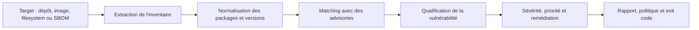
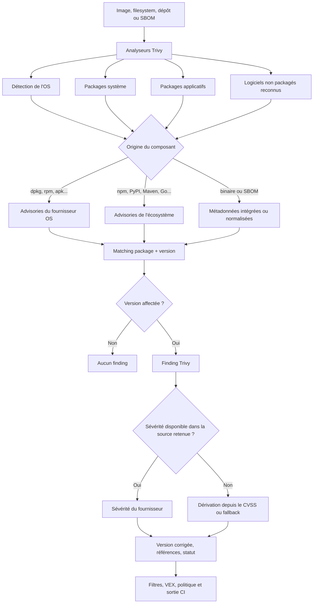
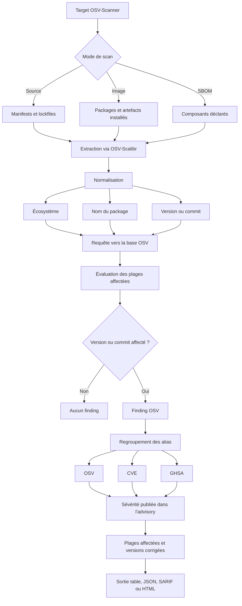
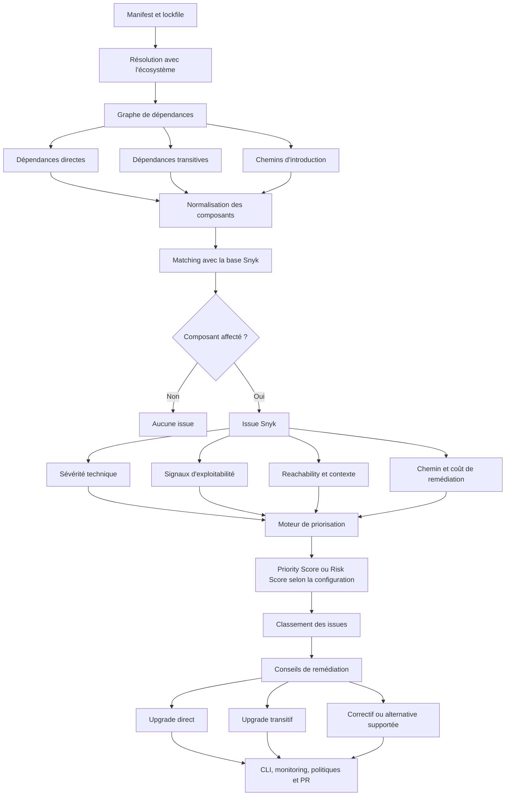
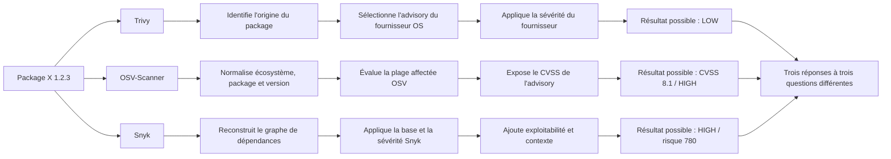
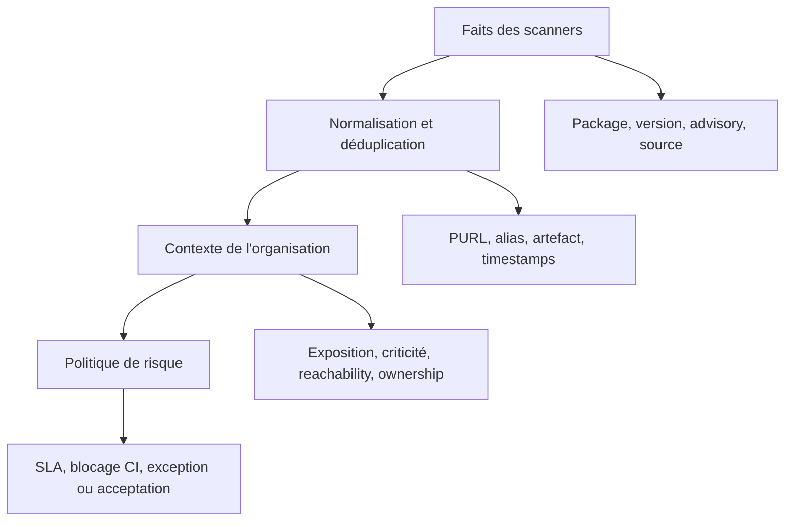
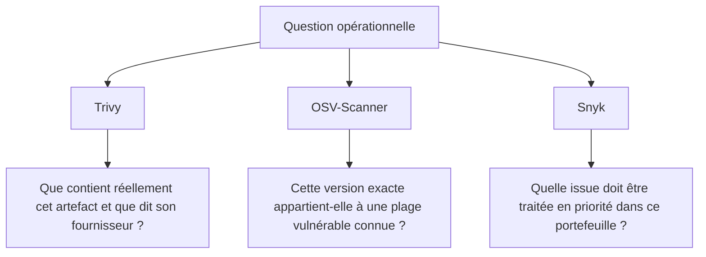

Trois scanners analysent le même dépôt ou la même image. L'un annonce douze vulnérabilités critiques, le deuxième en voit sept et le troisième affirme que deux seulement doivent être corrigées immédiatement.

La réaction habituelle consiste à chercher lequel se trompe. C'est souvent la mauvaise question.

Trivy, OSV-Scanner et Snyk ne suivent pas le même processus interne. Ils ne partent pas toujours des mêmes artefacts, ne résolvent pas les dépendances de la même manière, ne sélectionnent pas les mêmes sources de vulnérabilités et ne donnent pas le même sens au mot « score ».

Une divergence ne signifie donc pas nécessairement qu'un outil est faux. Elle peut signifier que les trois outils répondent à trois questions différentes :

- **Trivy** cherche à déterminer si le logiciel réellement présent dans un artefact est vulnérable, en tenant fortement compte du fournisseur de la distribution ;
- **OSV-Scanner** cherche à établir si une version précise appartient à une plage affectée décrite dans l'écosystème d'origine ;
- **Snyk** cherche aussi à organiser le travail de remédiation dans un projet et une organisation.

Cet article décrit leurs processus conceptuels. Il ne prétend pas reconstituer le code interne propriétaire de Snyk. Les diagrammes représentent les étapes observables et documentées qui expliquent les différences de résultat.

## Le pipeline commun : inventorier, faire correspondre, qualifier

Tout scanner de vulnérabilités suit au minimum trois opérations :

1. construire un inventaire logiciel ;
2. rapprocher cet inventaire d'une ou plusieurs bases d'advisories ;
3. qualifier puis restituer les correspondances.



La majorité des divergences naît avant même le calcul d'un score. Deux outils qui n'ont pas extrait le même package, résolu la même version ou choisi le même advisory ne peuvent pas produire le même résultat final.

Il faut donc séparer quatre notions souvent mélangées :

- **détection** : le composant a-t-il été trouvé ?
- **matching** : sa version est-elle comprise dans une plage affectée ?
- **sévérité** : quel est l'impact technique intrinsèque ou contextuel ?
- **priorité** : dans quel ordre l'organisation doit-elle agir ?

## Trivy : partir de l'artefact et faire confiance au fournisseur pertinent

Trivy est un scanner généraliste. Il peut analyser des images OCI, des systèmes de fichiers, des dépôts, des SBOM, des clusters Kubernetes, des configurations IaC, des secrets et des licences. Pour la partie vulnérabilités, son comportement repose d'abord sur la détection des packages réellement présents.

Lorsqu'il analyse une image, Trivy inspecte les métadonnées du système, les bases des gestionnaires de packages et les artefacts applicatifs reconnus. Il distingue notamment les packages installés par la distribution des packages installés par un gestionnaire applicatif comme `pip`, `npm`, Maven ou Go modules.



### Pourquoi Trivy peut afficher LOW quand le NVD affiche HIGH

Pour un package installé par le gestionnaire du système, Trivy sélectionne l'advisory du fournisseur de la distribution. Cette décision évite de comparer naïvement la version d'un package Debian, Ubuntu, Red Hat ou Alpine avec la version corrigée du projet upstream.

Les distributions maintiennent souvent une version apparemment ancienne tout en y rétroportant le correctif. Le numéro de version upstream peut donc laisser penser que le package est vulnérable alors que le correctif a déjà été intégré dans le package distribué.

Trivy privilégie également la sévérité provenant de cette source. Une CVE peut être classée HIGH par le NVD et LOW par Red Hat si les options de compilation, la configuration par défaut ou l'exposition réelle réduisent l'impact dans la distribution.

La valeur importante dans le rapport JSON n'est donc pas uniquement `Severity`. Il faut aussi conserver :

- `SeveritySource` ;
- les différentes valeurs de `VendorSeverity` ;
- la version installée ;
- la version corrigée ;
- l'origine du package.

Trivy permet par ailleurs de choisir entre une détection orientée **précision** et une détection plus **exhaustive**. Le mode précis réduit le bruit mais peut accepter davantage de faux négatifs. Le mode exhaustif cherche une couverture plus large au prix d'un risque accru de faux positifs.

Cette option modifie le compromis de détection. Elle ne transforme pas Trivy en moteur de priorisation métier.

## OSV-Scanner : représenter fidèlement les versions des écosystèmes

OSV-Scanner est centré sur la base OSV et sur la représentation native des versions dans chaque écosystème. Son intérêt principal n'est pas d'inventer une nouvelle note, mais de réduire les ambiguïtés de correspondance entre un package, une version et une plage affectée.

OSV distingue deux situations importantes :

- lors du scan d'un dépôt source, les manifests et surtout les lockfiles décrivent les dépendances attendues ;
- lors du scan d'une image, les artefacts réellement installés sont prioritaires par rapport à des lockfiles éventuellement abandonnés dans le filesystem.

L'extraction est aujourd'hui étroitement intégrée à OSV-Scalibr, qui identifie les packages, binaires et artefacts supportés avant l'interrogation de la base OSV.



### OSV répond d'abord à une question binaire

Le cœur du processus est proche de cette formulation :

```text
Cet écosystème + ce package + cette version
appartiennent-ils à une plage déclarée comme affectée ?
```

Cette approche évite une partie des approximations historiques fondées sur les CPE. Elle permet aussi de représenter des vulnérabilités qui n'ont pas nécessairement reçu de CVE, puis de regrouper les identifiants équivalents sous forme d'alias.

La note affichée dépend toutefois des informations publiées dans l'advisory. Une entrée OSV peut contenir un vecteur CVSS, plusieurs formes de sévérité ou aucune note exploitable. OSV-Scanner ne fabrique pas, par défaut, une priorité organisationnelle comparable à celle d'une plateforme commerciale.

OSV-Scanner est donc particulièrement utile pour répondre avec précision à la question de l'affectation d'une version. Il l'est moins, seul, pour décider quel risque doit mobiliser une équipe cette semaine.

## Snyk : construire le graphe, enrichir le finding, piloter la remédiation

Snyk couvre plusieurs familles d'analyse. Pour Snyk Open Source, le processus part généralement des manifests et lockfiles puis utilise les mécanismes de l'écosystème pour construire un graphe de dépendances.

Ce graphe est essentiel : il permet de distinguer les dépendances directes des dépendances transitives et d'expliquer par quel chemin une librairie vulnérable a été introduite.

Le composant est ensuite rapproché de la base de vulnérabilités Snyk. Le finding obtenu est enrichi avec des signaux techniques et contextuels : CVSS, exploit connu, maturité de l'exploit, probabilité d'exploitation, reachability lorsqu'elle est disponible, ancienneté et contexte applicatif ou organisationnel selon les capacités activées.



### Severity, Priority Score et Risk Score ne sont pas synonymes

Snyk distingue la gravité technique d'une vulnérabilité de l'urgence avec laquelle elle devrait être traitée.

La **severity** reste une classification technique, généralement exprimée avec les catégories LOW, MEDIUM, HIGH et CRITICAL.

Le **Priority Score** ajoute des signaux permettant d'ordonner les issues. Snyk introduit aussi un **Risk Score**, compris entre 0 et 1 000, fondé sur l'impact potentiel et la probabilité d'exploitation. Au moment de la rédaction, ce Risk Score est présenté en accès anticipé pour Snyk Open Source et Snyk Container et peut remplacer le Priority Score dans les configurations concernées.

La formule et les pondérations précises sont propriétaires. Il est donc possible d'auditer les signaux exposés, mais pas de reconstruire exactement le calcul à partir de la seule documentation publique.

Cette différence est structurelle : Trivy et OSV-Scanner produisent surtout des faits techniques locaux. Snyk cherche en plus à maintenir un état organisationnel, un historique, des propriétaires, des politiques et des workflows de correction.

## Pourquoi les trois résultats divergent

Prenons un package `X` en version `1.2.3` présent dans une image Linux et également référencé par un lockfile.



Les résultats peuvent différer pour au moins huit raisons :

1. un outil n'a pas détecté le composant ;
2. la version n'a pas pu être déterminée avec certitude ;
3. le lockfile ne représente pas ce qui est réellement installé ;
4. le package système contient un correctif rétroporté ;
5. les sources d'advisories ne sont pas synchronisées au même moment ;
6. les alias CVE, GHSA et OSV n'ont pas été dédupliqués ;
7. la sévérité provient d'acteurs différents ;
8. l'un des outils applique une priorisation contextuelle que les autres ne calculent pas.

Comparer uniquement le nombre de vulnérabilités ou la colonne `severity` détruit donc l'information nécessaire à l'analyse.

## Ce qu'il faut normaliser dans une plateforme interne

Lorsqu'une organisation agrège plusieurs scanners, elle doit conserver les faits avant de calculer sa propre politique.

Le modèle minimal devrait inclure :

```text
component.purl
component.name
component.version
component.type
component.origin
vulnerability.primary_id
vulnerability.aliases[]
vulnerability.affected_range
vulnerability.fixed_versions[]
severity.value
severity.score
severity.vector
severity.source
scanner.name
scanner.version
scanner.detected_at
artifact.digest
artifact.environment
exploit.evidence
reachability.status
vex.status
```

La clé de rapprochement ne doit pas être uniquement la CVE. Elle devrait combiner au minimum :

```text
PURL + version installée + alias de vulnérabilité + artefact analysé
```

Il faut ensuite distinguer trois couches :



Le scanner ne doit pas décider seul de la politique finale. Il fournit des observations dont la qualité et la provenance doivent rester visibles.

## Une stratégie pragmatique pour les pipelines

Pour une plateforme Kubernetes et des chaînes CI/CD modernes, les trois outils peuvent être positionnés de façon complémentaire.

### Trivy comme capteur opérationnel généraliste

Trivy est adapté aux contrôles rapides et reproductibles sur :

- les images de conteneurs ;
- les fichiers et dépôts ;
- les SBOM ;
- l'IaC ;
- les secrets ;
- les clusters Kubernetes.

Il fonctionne bien comme gate de pipeline, à condition de ne pas bloquer aveuglément sur `CRITICAL`. Le gate devrait intégrer au minimum la disponibilité d'un correctif, le statut VEX, l'environnement et la source de sévérité.

### OSV-Scanner comme deuxième lecture SCA

OSV-Scanner apporte une contre-analyse utile sur les dépendances applicatives et les lockfiles. Il permet notamment de vérifier qu'une divergence vient bien du matching de version et non d'un simple décalage de présentation.

Son rôle peut être celui d'un scanner spécialisé ou d'un mécanisme de validation lorsque Trivy, un SBOM et les outils natifs de l'écosystème ne convergent pas.

### Snyk comme couche de gouvernance, pas comme unique source de vérité

Snyk prend davantage de valeur lorsque plusieurs équipes doivent partager :

- un inventaire de projets ;
- des propriétaires ;
- des politiques communes ;
- un historique ;
- des campagnes de remédiation ;
- des PR automatiques ;
- une priorisation contextualisée.

Cette capacité ne dispense pas de conserver les résultats bruts. Une note propriétaire doit rester un signal de décision, pas devenir l'unique représentation du risque.

## La vraie question n'est pas « quel scanner a raison ? »

La question utile est : **quelle décision chaque scanner permet-il de prendre, avec quel niveau de preuve ?**



Trivy est fort lorsqu'il faut inspecter un artefact et respecter le contexte de la distribution. OSV-Scanner est fort lorsqu'il faut établir précisément le lien entre une version et une plage affectée. Snyk est fort lorsqu'il faut transformer des findings en programme de remédiation piloté à l'échelle de plusieurs équipes.

Les opposer sur le seul nombre de CVE est donc peu utile. Une chaîne mature conserve la provenance, normalise les identités, confronte les sources et applique sa propre politique de risque.

Le bon résultat n'est pas celui qui contient le plus de rouge. C'est celui qui permet d'expliquer pourquoi un composant est considéré comme vulnérable, pourquoi sa note diffère et quelle action proportionnée doit suivre.

## Sources officielles

- [Trivy — Vulnerability scanning, data source and severity selection](https://trivy.dev/docs/latest/scanner/vulnerability/)
- [Trivy — Container image scanning](https://trivy.dev/docs/latest/guide/target/container_image/)
- [OSV-Scanner — Supported artifacts and manifests](https://google.github.io/osv-scanner/supported-languages-and-lockfiles/)
- [OSV-Scanner — Output formats and severity information](https://google.github.io/osv-scanner/output/)
- [OSV Schema — Vulnerability data model](https://ossf.github.io/osv-schema/)
- [Snyk — View project issues, fixes and dependencies](https://docs.snyk.io/scan-with-snyk/snyk-open-source/manage-vulnerabilities/view-project-issues-fixes-and-dependencies)
- [Snyk — Priority Score](https://docs.snyk.io/manage-risk/prioritize-issues-for-fixing/priority-score)
- [Snyk — Risk Score](https://docs.snyk.io/manage-risk/prioritize-issues-for-fixing/risk-score)
- [Snyk Container — How container analysis works](https://docs.snyk.io/scan-with-snyk/snyk-container/how-snyk-container-works)
