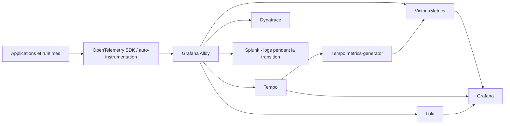

Je ne suis pas arrivé à OpenTelemetry parce qu'il fallait absolument "faire de l'OTel".

Le point de départ était beaucoup plus banal. Une plateforme disposait déjà de Prometheus et d'une observabilité Grafana utile aux équipes. En parallèle, une migration vers Dynatrace était demandée. Une partie importante de l'application était en C++, et le SDK utilisé jusque-là pour conserver certaines traces arrivait en fin de vie.

Il fallait donc réinstrumenter.

À partir de là, la vraie question n'était plus seulement de savoir comment envoyer des traces vers Dynatrace. Si nous devions toucher à environ 200 services, autant éviter de recommencer le même chantier au prochain changement de backend, de contrat ou de modèle de coût.

OpenTelemetry est devenu intéressant pour cette raison précise : **faire de l'instrumentation un contrat de plateforme plutôt qu'une dépendance à un outil d'observabilité particulier.**

Cela ne rend pas l'observabilité gratuite. Cela ne supprime pas l'exploitation. Cela ne transforme pas automatiquement des centaines de services en système parfaitement observable.

Mais cela change l'endroit où se trouve la dépendance.

## Le besoin initial : migrer sans perdre ce qui fonctionnait déjà

L'objectif n'était pas de remplacer Dynatrace par une pile open source.

Dynatrace devait continuer à recevoir logs, métriques et traces. La demande initiale devait être respectée. En revanche, nous ne voulions pas abandonner les usages Grafana déjà présents sur la plateforme, ni faire dépendre toute l'instrumentation applicative d'un unique backend.

Splunk était également encore utilisé pour certains dashboards de logs. Là encore, l'objectif n'était pas d'entretenir deux mondes indéfiniment. Il fallait conserver ces usages pendant la transition, le temps de migrer ce qui devait l'être.

L'architecture a donc progressivement pris cette forme :

Ce dessin simplifie volontairement la réalité. Alloy n'est pas déployé sous une seule forme. Selon le signal et le besoin, il peut être placé en `DaemonSet`, en `Deployment` ou derrière d'autres points de collecte.

Le principe, lui, reste stable : **les applications émettent selon un standard, puis la plateforme décide où les données doivent aller.**

## OpenTelemetry ne remplace pas les backends, il évite de leur donner le contrôle de l'instrumentation

C'est probablement le bénéfice que je retiens le plus.

OpenTelemetry ne remplace ni Tempo, ni VictoriaMetrics, ni Loki, ni Dynatrace. Il standardise la manière d'émettre et de transporter la télémétrie.

Cela paraît être une nuance de vocabulaire. En pratique, c'est une différence d'architecture.

Si l'application dépend directement d'un SDK propriétaire, un changement de backend devient potentiellement un chantier applicatif. Avec OpenTelemetry, le backend redevient beaucoup plus facilement une décision de plateforme.

Cela ne veut pas dire que tous les backends deviennent interchangeables. Les modèles de requête, les dashboards, les alertes, les fonctionnalités propriétaires et les coûts d'ingestion continuent à différer fortement.

Mais le code métier ne devrait pas avoir à connaître ces choix.

C'est aussi ce qui permet d'envoyer des données différentes vers plusieurs destinations. Dynatrace reçoit les signaux dont il a besoin. Grafana reste utilisé pour l'exploitation de la plateforme. Splunk peut continuer à recevoir certains logs tant que les dashboards correspondants n'ont pas été migrés.

**Une destination ne doit pas recevoir des données simplement parce qu'elles existent. Elle doit recevoir ce qui lui est utile.**

## Pourquoi Alloy plutôt qu'un Collector minimal

Nous aurions pu nous contenter du Collector OpenTelemetry upstream.

Alloy nous a apporté autre chose : une distribution capable de manipuler les pipelines OpenTelemetry tout en intégrant l'écosystème Prometheus et un ensemble d'exporters utiles à la plateforme.

Dans notre contexte, les composants Azure, SQL Server ou MongoDB ont notamment compté. Alloy embarque par exemple des exporters pour Azure Monitor, Microsoft SQL Server et MongoDB. Cela évite de multiplier les petits démons et les configurations indépendantes pour chaque source.

Sa configuration est aussi assez lisible une fois le modèle compris, et l'interface web aide beaucoup pour suivre les composants et leurs relations.

Enfin, il se prête bien à plusieurs modèles de déploiement. Nous pouvons utiliser des instances proches des workloads, d'autres comme gateways, et adapter le périmètre de chaque instance au signal collecté.

Le point important n'est pas qu'Alloy serait "meilleur" dans l'absolu. Il correspondait bien à un contexte où nous devions faire cohabiter OpenTelemetry, Prometheus et plusieurs sources d'infrastructure sans construire une collection de pipelines séparés.

## Le vrai chantier était l'adoption sur environ 200 services

Installer un collector est relativement simple.

Faire en sorte que 200 services, écrits à différentes époques et dans plusieurs langages, produisent une télémétrie cohérente est un autre travail.

L'application la plus ancienne a environ quinze ans. La couverture de tests existe, mais elle n'est pas parfaite. Comme dans beaucoup de systèmes brownfield, demander une refonte propre avant de commencer aurait surtout garanti que le projet ne se termine jamais.

Nous avons donc cherché à minimiser le changement.

Une task force a accompagné la R&D. Nous avons organisé des ateliers, codé avec les équipes et préparé des instructions réutilisables dans Cursor ou Claude pour expliquer comment intégrer OpenTelemetry dans les SDK et les services sans réécrire l'application.

L'IA a été particulièrement utile sur cette partie répétitive : retrouver le point d'initialisation, ajouter le SDK, appliquer les conventions, propager le contexte ou préparer une première version de l'instrumentation.

Mais le workflow restait classique :

1. modification du service ;
2. revue de la PR ;
3. déploiement en environnement de développement ;
4. vérification des signaux ;
5. correction avec l'équipe si nécessaire.

Ce modèle nous a permis d'avancer sur l'ensemble du parc en quelques semaines.

Le point qui compte n'est pas la présence d'un LLM dans le processus. **Le gain vient du fait que les conventions avaient été décidées avant de demander à l'outil de les appliquer.**

Sans cadre, un assistant de code permet surtout d'instrumenter très vite 200 services de 200 manières différentes.

## Les traces deviennent utiles quand elles expliquent quelque chose

Au départ, une grande partie de la valeur vient déjà des traces techniques : appels HTTP, accès SQL, dépendances externes, erreurs.

Elles nous ont permis de mettre en évidence plusieurs comportements dans la partie C++ que nous comprenions mal depuis les métriques seules.

Nous avons par exemple retrouvé des requêtes SQL mal gérées qui provoquaient des consommations mémoire et CPU anormales. D'autres traces ont montré des appels répétés qui auraient dû être mis en cache.

Ce sont des problèmes très classiques. Ce qui change, c'est le temps nécessaire pour passer d'un symptôme global à une portion précise du chemin d'exécution.

Nous avons aussi commencé à accompagner les développeurs sur des spans plus proches du métier. Pas au point de transformer chaque opération fonctionnelle en span ni de chercher immédiatement un modèle parfait.

Le premier objectif était la couverture.

C'est un arbitrage important en brownfield : **une instrumentation imparfaite mais présente sur 200 services peut être plus utile qu'un modèle magnifique déployé sur les six services que nous avons eu le temps de traiter.**

La qualité vient ensuite, quand les équipes commencent réellement à interroger les traces et comprennent ce qui leur manque.

## Premier piège : l'observabilité peut elle-même perturber la production

L'auto-instrumentation fournie par l'OpenTelemetry Operator est extrêmement pratique pour accélérer un déploiement Kubernetes.

Elle permet de centraliser une partie de la configuration et d'injecter l'instrumentation sans demander à chaque équipe de reproduire le même mécanisme.

Mais "automatique" ne signifie pas "sans impact".

Sur certains jobs éphémères, nous avons rencontré en production un problème lié aux `emptyDir` utilisés dans notre mécanisme d'injection. Sous la charge réelle, les I/O disque se sont saturées et les effets se sont propagés jusqu'au scheduling des workloads.

Les environnements moins chargés n'avaient pas reproduit le problème.

La première décision a été très simple : désactiver l'instrumentation concernée en production pour restaurer la capacité, puis reprendre le sujet correctement.

Je ne généralise pas cet incident à l'Operator OpenTelemetry. C'est précisément l'inverse de la leçon à tirer.

La leçon est que **l'observabilité fait partie du système qu'elle observe**. Elle consomme du CPU, de la mémoire, du réseau, du disque et des objets Kubernetes. Elle doit donc être testée sous une charge représentative comme n'importe quelle autre brique de plateforme.

Une instrumentation qui fait tomber le workload pour mieux expliquer pourquoi il tombe reste une mauvaise instrumentation.

## Deuxième piège : une bonne dimension de trace peut être une catastrophe métrique

Notre meilleure leçon de cardinalité est venue de la partie C++.

Nous avions ajouté le nom de la base comme information dans les traces.

Sur le papier, c'était utile. Le système travaille avec environ 400 000 bases. Pouvoir identifier celle concernée par une opération facilite énormément le diagnostic.

Le problème est arrivé plus loin dans la chaîne.

Tempo peut générer des métriques à partir des spans. Son `metrics-generator` calcule notamment des métriques RED à partir de combinaisons de dimensions. Ces métriques étaient ensuite envoyées vers VictoriaMetrics.

Une donnée qui était acceptable dans une trace est donc devenue, dans notre configuration, une dimension métrique avec un nombre de valeurs potentiellement énorme.

La cardinalité a fait le reste.

C'est une erreur intéressante parce qu'elle ne vient pas d'un label manifestement absurde ajouté directement dans Prometheus. Elle vient d'une donnée pertinente à un endroit de la chaîne qui devient dangereuse lorsqu'elle change de représentation.

La correction a consisté à empêcher cette information dynamique de devenir une dimension métrique non bornée. Le détail dépend du pipeline et de la manière dont les métriques sont générées. Le principe, lui, est réutilisable :

> Avant d'ajouter un attribut à un signal, il faut savoir ce qu'il peut devenir dans les étapes suivantes.

Un identifiant de requête, un identifiant utilisateur, un UUID de job, un nom de fichier ou une base parmi plusieurs centaines de milliers peuvent être parfaitement acceptables dans un log ou une trace et catastrophiques comme label de série.

La cardinalité n'est donc pas un sujet uniquement Prometheus. C'est un sujet de **modélisation de la télémétrie**.

## Les logs posent le même problème avec les données sensibles

La normalisation des logs nous a aussi obligés à reprendre la question des données sensibles.

Nous avons modifié une bibliothèque commune pour ajouter les informations nécessaires à la corrélation entre logs et traces. En parallèle, nous avons introduit du filtrage des PII, RIB et autres données qui n'ont rien à faire dans un backend d'observabilité.

Nous avons choisi de filtrer à deux niveaux : dans les bibliothèques communes lorsque nous contrôlons la production du log, puis dans la couche de collecte pour disposer d'une seconde protection.

Une partie de ce filtrage repose sur des expressions régulières. Ce n'est pas magique et cela ne remplace pas une gouvernance des champs, mais c'est utile comme filet supplémentaire.

Là encore, OpenTelemetry n'apporte pas automatiquement une stratégie de données.

Il rend le transport plus cohérent. **Il faut encore décider ce que nous avons le droit de transporter.**

## Sampling : collecter tout n'est pas un signe de maturité

En production, le volume de traces doit rester maîtrisé.

Notre cible opérationnelle est simple : conserver les signaux les plus intéressants et échantillonner fortement le trafic normal. Dans notre cas, un ordre de grandeur d'environ 10 % du trafic courant est déjà largement suffisant pour comprendre la majorité des comportements.

La configuration du sampling est centralisée via l'instrumentation gérée par l'OpenTelemetry Operator. Cela évite d'aller modifier service par service lorsqu'il faut ajuster le ratio.

Il faut toutefois être précis sur une phrase que l'on entend souvent : "je garde toutes les erreurs et 10 % du reste".

Un simple head sampling probabiliste à 10 % ne peut pas garantir cela. La décision est prise au début de la trace, avant de savoir si une erreur apparaîtra plus loin. Si l'exigence est réellement de conserver toutes les traces contenant une erreur, il faut une décision plus tardive, typiquement du tail sampling, ou un mécanisme équivalent capable d'observer suffisamment de la trace avant de décider.

C'est un bon exemple de la différence entre une politique souhaitée et une propriété techniquement garantie.

Le sampling n'est pas uniquement une optimisation de coût. Il protège aussi le pipeline de télémétrie lui-même.

## Un dashboard Grafana peut coûter très cher sans envoyer la moindre facture

Une fois les signaux disponibles, nous avons rencontré un autre problème très classique : les dashboards.

Certains devenaient très lents. D'autres requêtes mettaient réellement sous pression VictoriaMetrics, Loki ou Tempo.

Le problème venait rarement d'une seule cause.

Nous avions de la cardinalité à nettoyer, mais également des requêtes lourdes recalculées à chaque affichage. Les plages longues, typiquement 1 jour, 7 jours ou 30 jours, peuvent devenir très coûteuses lorsque chaque ouverture de dashboard déclenche de nouveau les mêmes agrégations.

Les recording rules ont beaucoup aidé.

Au lieu de recalculer systématiquement certaines expressions coûteuses, `vmalert` permet de les évaluer à intervalle défini et d'enregistrer le résultat comme de nouvelles séries. Il devient alors possible de servir des dashboards avec des données déjà agrégées plutôt que de demander au backend de reconstruire la même réponse en permanence.

La combinaison qui nous a réellement aidés a été assez peu spectaculaire :

- réduire la cardinalité ;
- supprimer ce qui n'apporte pas de valeur ;
- pré-calculer certaines expressions ;
- adapter les requêtes aux usages réels ;
- surveiller les backends d'observabilité comme les autres composants de production.

Grafana n'est pas lent ou rapide par nature. Il exécute les questions qu'on lui donne.

**Un dashboard n'est pas gratuit simplement parce qu'il ne fait qu'afficher des données.**

## En brownfield, on ne peut pas commencer par tout fermer

Sur une plateforme neuve, je ferais aujourd'hui beaucoup de choses dans l'autre sens.

Je commencerais avec une liste beaucoup plus restrictive d'attributs, des conventions de nommage explicites, une stratégie de sampling définie dès le départ, des budgets de cardinalité et des règles très claires sur les PII.

J'ouvrirais progressivement ce qui est nécessaire.

Sur un système existant, c'est plus compliqué.

Supprimer brutalement un champ, arrêter une source ou couper un backend parce qu'il "ne devrait plus servir" est une excellente manière de découvrir le dashboard oublié qu'une équipe utilise tous les matins.

C'est exactement pour cette raison que Splunk existe encore temporairement dans notre architecture. Certains dashboards doivent d'abord être migrés. Tant que nous n'avons pas prouvé qu'un usage peut disparaître, nous évitons de le casser au nom de la pureté architecturale.

Le brownfield demande donc souvent une transition plus permissive :

1. rendre les flux visibles ;
2. mesurer les usages ;
3. migrer ou supprimer ce qui peut l'être ;
4. resserrer progressivement les contrats.

Le greenfield permet plus facilement l'approche inverse :

1. rien par défaut ;
2. chaque dimension est justifiée ;
3. chaque destination a un besoin explicite ;
4. l'ouverture se fait à mesure que les usages apparaissent.

La cible peut être la même. Le chemin ne l'est pas.

## Open source ne veut pas dire sans coût

Cette architecture demande de la maintenance.

Les volumes évoluent. Les disques se remplissent. Les règles deviennent plus nombreuses. Les versions changent. Les pipelines doivent être observés. La rétention doit être réglée. Les dashboards doivent être repris. Les équipes inventent de nouveaux labels auxquels personne n'avait pensé.

Ce n'est donc pas une recette universelle pour économiser une licence SaaS.

Même une petite équipe peut exploiter une pile de ce type, mais il faut comparer honnêtement les coûts.

Une offre managée ou un SaaS peut être beaucoup plus rationnel si l'équipe ne souhaite pas posséder cette compétence. À l'inverse, une plateforme qui possède déjà des besoins importants, plusieurs destinations et une équipe capable de l'opérer peut gagner énormément en maîtrise avec une couche de collecte standardisée.

Le calcul ne doit pas opposer "gratuit" à "payant".

Il faut comparer :

- coût d'ingestion et de rétention ;
- coût humain d'exploitation ;
- coût du stockage et du compute ;
- coût de migration futur ;
- dépendance au fournisseur ;
- valeur des fonctionnalités managées ;
- capacité réelle de l'équipe à maintenir la solution.

Dans notre cas, le travail supplémentaire vaut le coup. La plateforme est plus proactive, les équipes disposent de meilleurs outils de diagnostic, et nous avons pu accompagner la demande Dynatrace sans abandonner ce qui fonctionnait déjà.

## Ce que je retiens après cette migration

Je retiens surtout cinq choses.

**OpenTelemetry vaut par le contrat qu'il crée, pas par le nombre de composants qu'il permet d'installer.** L'objectif est de rendre l'instrumentation durable même lorsque les backends changent.

**La couverture arrive avant la sophistication en brownfield.** Sur environ 200 services, nous avons préféré accompagner rapidement les équipes avec des conventions communes, puis améliorer la qualité des spans à mesure que les usages apparaissaient.

**La télémétrie doit être modélisée comme de la donnée de production.** Cardinalité, PII, rétention, volume et destination ne sont pas des détails d'exploitation à traiter après coup.

**Le pipeline d'observabilité a besoin de sa propre ingénierie de fiabilité.** L'auto-instrumentation peut provoquer des effets de bord, un collector peut saturer, une requête Grafana peut coûter cher et un sampling mal compris peut donner une fausse impression de couverture.

**La réversibilité a un prix, mais elle a aussi une valeur.** Nous pouvons aujourd'hui continuer à exploiter Grafana, répondre au besoin Dynatrace, maintenir temporairement Splunk pendant la migration et faire évoluer les destinations sans réinstrumenter l'ensemble de l'application.

C'était finalement le vrai objectif.

Pas construire la plus belle stack d'observabilité.

**Construire une observabilité que la plateforme peut faire évoluer sans redemander la permission au code applicatif à chaque changement de backend.**

## Sources officielles

- [OpenTelemetry : injection de l'auto-instrumentation avec l'Operator](https://opentelemetry.io/docs/platforms/kubernetes/operator/automatic/)
- [OpenTelemetry : head sampling, tail sampling et compromis](https://opentelemetry.io/docs/concepts/sampling/)
- [OpenTelemetry : architecture du Collector](https://opentelemetry.io/docs/collector/architecture/)
- [Grafana Alloy : OpenTelemetry et collecte OTLP](https://grafana.com/docs/alloy/latest/collect/opentelemetry-data/)
- [Grafana Alloy : composants Prometheus et exporters](https://grafana.com/docs/alloy/latest/reference/components/prometheus/)
- [Grafana Tempo : métriques générées à partir des traces](https://grafana.com/docs/tempo/latest/metrics-from-traces/metrics-generator/)
- [Grafana Tempo : cardinalité du metrics-generator](https://grafana.com/docs/tempo/latest/metrics-from-traces/metrics-generator/cardinality/)
- [VictoriaMetrics : vmalert et recording rules](https://docs.victoriametrics.com/victoriametrics/vmalert/)
